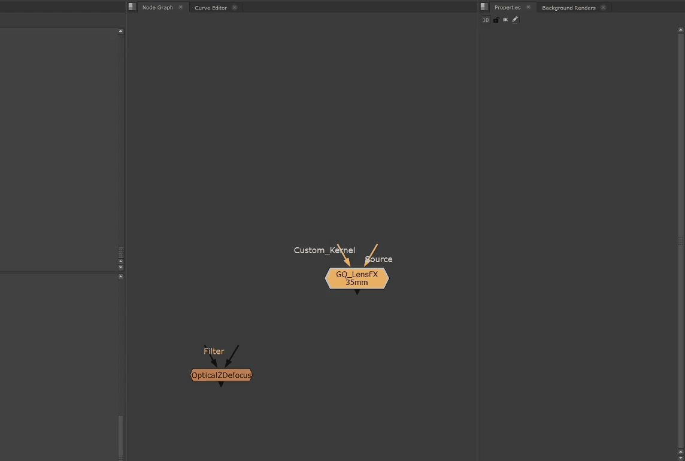

## LensFX_GQ
This is my all in one tool for depth of field, it brings several popular nodes together into one gizmo. The nodes are then linked and controlled via a set of simple, real world controls.

The main goal behind this tool was to create a digital "Lens Sets" workflow, giving artist a set of preset lenses with pre-defined looks. The aim being to keep the look across a project consistent. You can customise each lenses focal length and optical qualities. With some qualities, the more you open the lens, the stronger the effects.

One common problem with compositing depth of field is artifacts around edges, sometimes switching tools is enough to solve it. The best way to get rid of the problem (without Deep) it is to separate out the comp into BG and FG layers and defocus them individually. This tool supports that workflow with a Parent/Child relationship, you are able to duplicate the gizmo, and use the "Set Master" button to make that node control others. Child nodes will become locked, meaning you only have to tweak the Parent.

ZDefocus is included by default, but does not support physical lens simulation, you are able to customise the min and max blur of each lens using the lens set, and the aperture slider will blend between these values. pgBokeh and Optical Z Defocus both support real world simulation, and the strength of the blur is driven solely by the Aperture and sensor size values.

### Lens Sets

The gizmo makes use of "Lens Sets" this is to emulate having a limited set of lenses as you would on a Live Action shoot, each with their own unique qualities. Each lens can be customised with:

- Focal Length
- Glow
- DOF Strength (only applicable for zDefocus. - OpticalZDefocus and PGBokeh will use real world simulation)
- Chromatic Aberration
- Aperture Blades

You can have any number of lenses in a set, and each can be totally customised, this gives them all a slightly different feel, there is an example .json file provided on Github, which you can use as a starting point. **You must have one loaded into the "Lens Data Path" in "Advanced" for the tool to function.**

The optical qualities, currently chromatic aberration and glow, are tied to the aperture value, like a real lens, these are stronger when the aperture is open wider, see the comparison below for an example.

### Adding 3rd Party Tools

In order to add [OpticalZDefocus](https://gist.github.com/jedypod/50a3b68f9b5bbe487e1a) or [PGBokeh](https://peregrinelabs.com/bokeh/) you need to have one present in the node graph for LensFX to pick up, after that you simply need to press the appropriate button in the "Advanced tab" and the node will be integrated, and should be available in the "Pick Focus Tool" menu.

Once you have done this you can save the file and use it freely and add it to your pipeline.

### Master + Child

Group nodes in Nuke can't be cloned but sometimes you need multiple DOF nodes, so I included a "Set Master" function. Pressing the button will make the current node the scripts master, it will turn blue, all other LensFX nodes in the script will become children, and their controls will be locked and get their values from the master. 

If you want to break this connection, you simply hit the "Set Master" button again, which will clear all children. If you press this button on a child node, it will become the new master.